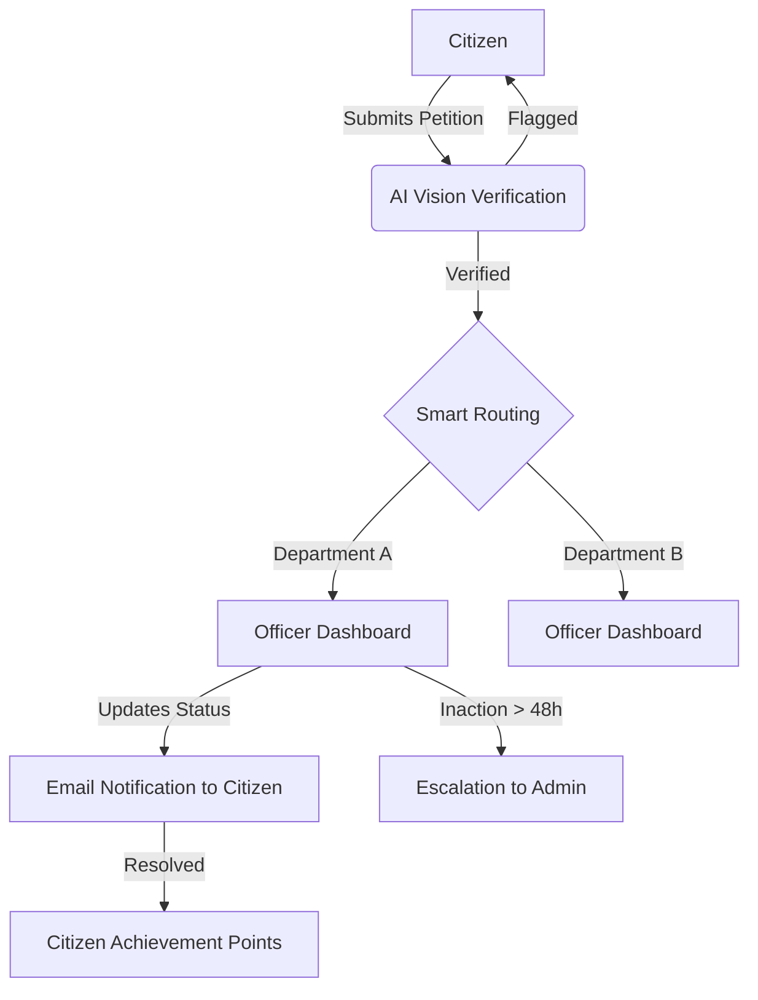

# 🏛️ AI Petition Hub — Digital Governance Redefined

[](https://github.com/Harishganth-0704/AI-petiton-)
[](LICENSE)
[](#tech-stack)


**AI Petition Hub** (Civic Harmony) is a state-of-the-art, AI-driven civic governance platform that bridges the gap between citizens and local government. By leveraging AI Vision, Text Intelligence, and Gamification, it ensures transparent, efficient, and accountable grievance redressal.

## 📌 Table of Contents
- [🌟 Key Features](#-key-features)
- [⚙️ How it Works](#️-how-it-works)
- [🛠️ Tech Stack](#️-tech-stack)
- [📂 Project Structure](#-project-structure)
- [🚀 Quick Start](#-quick-start)
- [🗺️ Roadmap](#️-roadmap)
- [🤝 Contributing](#-contributing)
- [📄 License](#-license)

---

## 🌟 Key Features

### 🤖 Intelligent AI Core
- **AI Visual Proof Verification**: Automatically analyzes petition images using **Google Gemini** to prevent fraudulent reports and verify descriptions.
- **Smart Dept Routing**: NLP-driven classification ensures every issue goes to the right department instantly.
- **Intelligent Assistant**: A multi-language AI Chatbot that helps citizens draft their complaints in seconds.

### 🎮 Civic Gamification & Social Impact
- **Citizen Hero Leaderboard**: Rewards active contributors with points and badges, fostering a sense of community responsibility.
- **Community Upvoting**: Localized support system allowing high-priority issues to gain visibility.
- **Official PDF Receipts**: Professional acknowledgment receipts downloadable instantly after submission.

### 📈 Administrative Transparency
- **48-Hour Accountability**: Automated escalation system that flags ignored petitions to higher authorities.
- **Heatmaps & Trend Analytics**: Visualizing town-wide grievance density for better administrative planning.
- **Officer AI Assistant**: Generates formal response drafts for government officers, saving administrative time.

---

## ⚙️ How it Works



---

## 🛠️ Tech Stack

### Frontend
- **Framework**: React 18 (Vite + TypeScript)
- **Styling**: Tailwind CSS & Framer Motion
- **Maps**: Leaflet.js
- **State**: TanStack Query (React Query)

### Backend
- **Environment**: Node.js & Express
- **Database**: PostgreSQL (Prisma/Neon)
- **AI**: Google Gemini Pro (Vision & Text)
- **Notifications**: Nodemailer (Email)

---

## 📂 Project Structure

```text
AI-Petition-Main
├── .github/                # Issue & PR Templates
├── android/                # Capacitor Android Build
├── public/                 # Static Assets
├── screenshots/            # Project Media & Banners
├── server/                 # Node.js Backend API
│   ├── routes/             # API Endpoints
│   ├── services/           # AI & Email Logic
│   └── prisma/             # Database Schema
├── src/                    # React Frontend
│   ├── components/         # Reusable UI Components
│   ├── pages/              # Application Views
│   ├── lib/                # API Helpers & Utils
│   └── locales/            # i18n Translations (Tamil/English/etc.)
└── package.json            # Dependencies & Scripts
```

---

## 🚀 Quick Start

### 1. Requirements
- Node.js (v18+)
- PostgreSQL Database

### 2. Installation
```bash
# Clone the repository
git clone https://github.com/Harishganth-0704/AI-petiton-.git
cd AI-Petition-Main

# Install dependencies
npm install
cd server && npm install
```

### 3. Configuration
Create a `.env` file in the `/server` directory:
```env
DATABASE_URL=your_postgresql_url
JWT_SECRET=your_jwt_secret
GEMINI_API_KEY=your_gemini_key
EMAIL_USER=your_email
EMAIL_PASS=your_app_password
```

### 4. Run Development
```bash
# Start Backend
cd server && npm run dev

# Start Frontend (New Terminal)
npm run dev
```

---

## 🗺️ Roadmap
- [ ] **Mobile App**: Expand Capacitor integration for full iOS/Android support.
- [ ] **Blockchain Logging**: Immutable audit logs for petition status changes.
- [ ] **Voice Petitions**: Allowing citizens to record voice notes for accessibility.
- [ ] **SMS Integration**: Scaling notifications beyond email.

---

## 🤝 Contributing
Contributions make the open-source community an amazing place to learn, inspire, and create. Please read our [CONTRIBUTING.md](CONTRIBUTING.md) for details on our code of conduct and the process for submitting pull requests.

## 📄 License
This project is licensed under the **MIT License** - see the [LICENSE](LICENSE) file for details.

*Built with ❤️ for a Smarter, Transparent Governance.*
