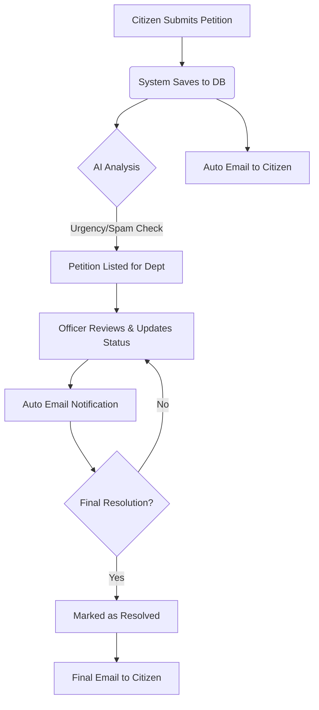

# Civic Harmony - Project Workflow Guide

This document explains how the Civic Harmony system works, from a citizen submitting a petition to its final resolution by the government departments.

---

## 1. User Roles & Access

The system performs differently depending on who is logged in:

- **Citizen**: The general public. They can submit issues (petitions) and track them.
- **Officer**: Government employees assigned to specific departments (e.g., Water, Roads). They only see and manage issues related to their department.
- **Admin**: System administrators who monitor the entire platform, manage officers, and oversee all petitions.

---

## 2. End-to-End Workflow

### Step 1: Petition Submission (Citizen)
1. A **Citizen** logs in and goes to the "Submit Petition" page.
2. They fill in the details: **Title, Description, Category (Department), and Location**.
3. They can also upload an image or video as evidence.
4. **Action**: The citizen clicks "Submit".

### Step 2: Automated Processing (System Backend)
1. **Database Storage**: The petition is saved in the PostgreSQL database with an initial status of `submitted`.
2. **AI Analysis**: The system automatically analyzes the petition:
   - **Urgency**: Detects how critical the issue is.
   - **Fake Probability**: Checks if the petition might be spam or fake.
   - **Keywords**: Extracts important terms for better categorization.
3. **Email Notification**: An automated confirmation email is sent to the citizen's registered email address.

### Step 3: Department Assignment (Officer)
1. The petition appears on the **Officer Dashboard** of the relevant department (e.g., a "Water" issue goes to the Water Department Officer).
2. The Officer reviews the petition, including any AI insights provided.
3. **Action**: The Officer updates the status to `in_progress` and adds a remark (e.g., "Team dispatched to the location").

### Step 4: Tracking & Updates (Citizen & System)
1. Every time an Officer updates the status or adds a remark, the **Citizen** receives an automated email notification.
2. The Citizen can also manually track the progress using their **Petition ID** on the "Track Issue" page.
3. The petition status moves through stages: `Submitted` → `In Progress` → `Verification` → `Resolved`.

### Step 5: Resolution
1. Once the work is done, the Officer marks the petition as `Resolved`.
2. A final confirmation email is sent to the Citizen.
3. The petition is moved to the "Resolved" history.

---

## 3. How to Run the Project Locally

To run this project on your computer, you need to start both the **Frontend** and the **Backend**.

### Prerequisites
- Node.js installed
- PostgreSQL database running

### Running the Backend (Server)
1. Open a terminal in the `server` folder.
2. Create or update your `.env` file with database and SMTP credentials.
3. Run:
   ```bash
   npm install
   npm run dev
   ```
   *The server usually runs on port 5000.*

### Running the Frontend (Client)
1. Open a new terminal in the root folder.
2. Run:
   ```bash
   npm install
   npm run dev
   ```
   *The frontend usually runs on port 5173.*

### Accessing the App
Open your browser and go to: `http://localhost:5173`

---

## 4. Visual Workflow Diagram


